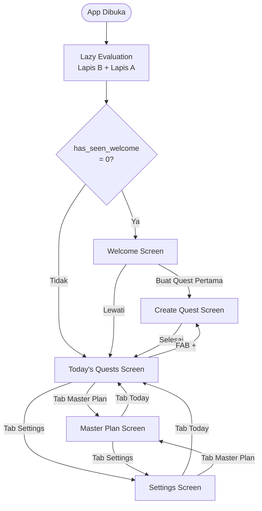
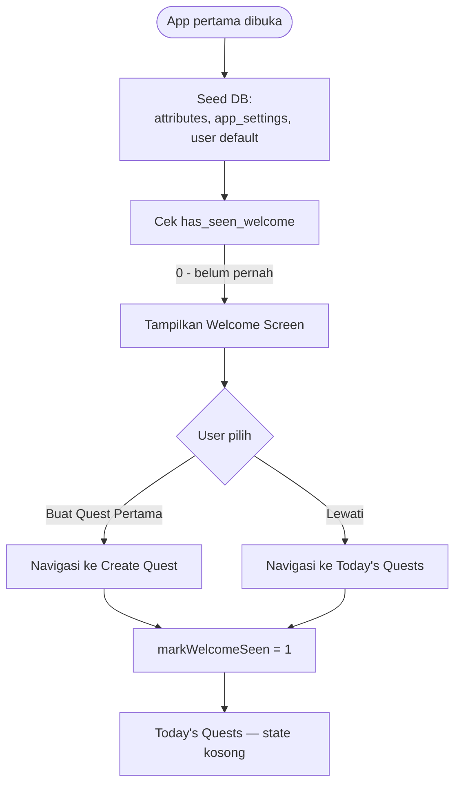
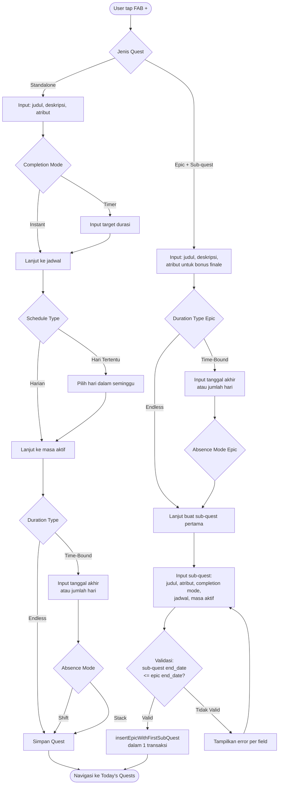
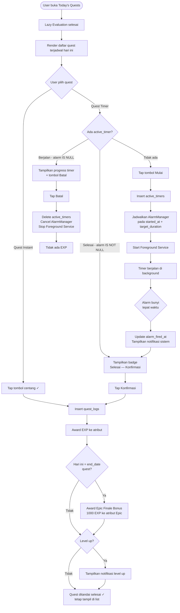
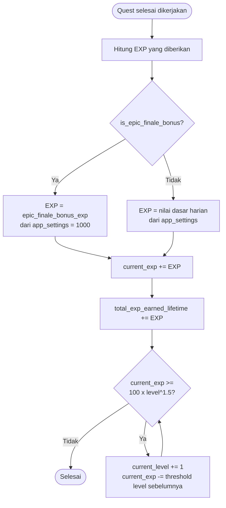
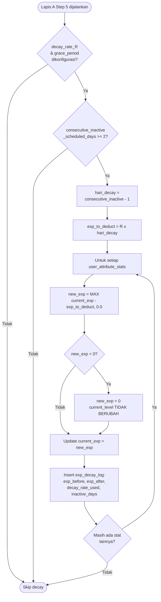
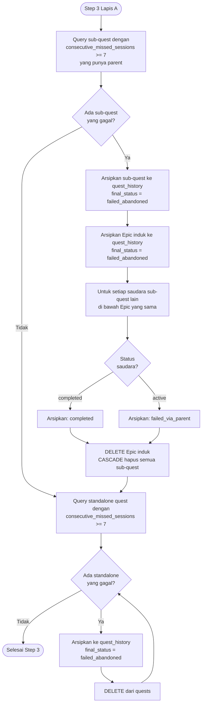
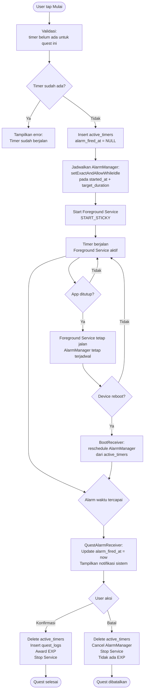

# PRD — Quest DDay (MVP)

## 1. Visi & Filosofi

Aplikasi produktivitas dan pelacak kebiasaan yang berfokus pada **durasi penyelesaian tugas**
dengan fleksibilitas waktu tinggi. Elemen RPG digunakan sebagai alat visualisasi data
untuk membangun motivasi intrinsik — bukan sebagai gimmick.

---

## 2. Tech Stack

| Layer | Pilihan |
|---|---|
| Bahasa | Kotlin |
| UI | Jetpack Compose (Material3) |
| Database | Room (raw `@Query` SQL) |
| Navigasi | Navigation Compose |
| Concurrency | Coroutines + Flow |
| Timer aktif | Foreground Service (native Android) |
| Timer state persistence | DataStore / active_timers DB |
| Notifikasi terjadwal | AlarmManager + BroadcastReceiver |
| Background decay/failure | Tidak ada — lazy evaluation saat app dibuka |
| Platform | Android only, minimum SDK 26 |

---

## 3. Schema Database

### `users`
```sql
CREATE TABLE users (
    id INTEGER PRIMARY KEY AUTOINCREMENT,
    username TEXT NOT NULL DEFAULT 'Adventurer',
    last_active_at TEXT NOT NULL DEFAULT (datetime('now')),
    last_evaluated_date TEXT,
    consecutive_inactive_scheduled_days INTEGER NOT NULL DEFAULT 0,
    total_exp_earned_lifetime REAL NOT NULL DEFAULT 0,
    has_seen_welcome INTEGER NOT NULL DEFAULT 0,
    created_at TEXT NOT NULL DEFAULT (datetime('now'))
);
```

### `attributes`
```sql
CREATE TABLE attributes (
    id INTEGER PRIMARY KEY AUTOINCREMENT,
    code TEXT NOT NULL UNIQUE,
    display_name TEXT NOT NULL,
    icon TEXT,
    is_default INTEGER NOT NULL DEFAULT 0,
    sort_order INTEGER DEFAULT 0
);
```

### `user_attribute_stats`
```sql
CREATE TABLE user_attribute_stats (
    id INTEGER PRIMARY KEY AUTOINCREMENT,
    user_id INTEGER NOT NULL,
    attribute_id INTEGER NOT NULL,
    current_level INTEGER NOT NULL DEFAULT 1,
    current_exp REAL NOT NULL DEFAULT 0,
    last_gained_at TEXT,
    updated_at TEXT NOT NULL DEFAULT (datetime('now')),
    FOREIGN KEY (user_id) REFERENCES users(id) ON DELETE CASCADE,
    FOREIGN KEY (attribute_id) REFERENCES attributes(id) ON DELETE RESTRICT,
    UNIQUE (user_id, attribute_id)
);
```

### `quests`
```sql
CREATE TABLE quests (
    id INTEGER PRIMARY KEY AUTOINCREMENT,
    user_id INTEGER NOT NULL,
    parent_quest_id INTEGER,
    attribute_id INTEGER,

    title TEXT NOT NULL,
    description TEXT,

    -- Apakah ini Epic container (punya sub-quest) atau quest yang dieksekusi langsung
    is_container INTEGER NOT NULL DEFAULT 0,

    -- Completion (NULL jika is_container = 1)
    completion_mode TEXT CHECK (completion_mode IN ('instant', 'timer')),
    target_duration_seconds INTEGER,

    -- Masa aktif
    duration_type TEXT NOT NULL CHECK (duration_type IN ('endless', 'time_bound')),
    duration_input_type TEXT CHECK (duration_input_type IN ('date', 'days')),
    target_days INTEGER,
    start_date TEXT NOT NULL DEFAULT (date('now')),
    end_date TEXT,

    -- Absence mode (NULL jika duration_type = 'endless')
    absence_mode TEXT CHECK (absence_mode IN ('shift', 'stack')),
    stacked_duration_seconds INTEGER NOT NULL DEFAULT 0,

    -- Jadwal (NULL jika is_container = 1)
    schedule_type TEXT DEFAULT 'daily' CHECK (schedule_type IN ('daily', 'custom_days')),
    schedule_days TEXT, -- CSV: '1,3,5' = Senin,Rabu,Jumat (1=Senin..7=Minggu)

    -- Status & tracking
    status TEXT NOT NULL DEFAULT 'active' CHECK (status IN ('active', 'completed', 'failed')),
    consecutive_missed_sessions INTEGER NOT NULL DEFAULT 0,
    last_completed_at TEXT,

    created_at TEXT NOT NULL DEFAULT (datetime('now')),
    updated_at TEXT NOT NULL DEFAULT (datetime('now')),

    FOREIGN KEY (user_id) REFERENCES users(id) ON DELETE CASCADE,
    FOREIGN KEY (parent_quest_id) REFERENCES quests(id) ON DELETE CASCADE,
    FOREIGN KEY (attribute_id) REFERENCES attributes(id) ON DELETE SET NULL
);

CREATE INDEX idx_quests_user_status ON quests(user_id, status);
CREATE INDEX idx_quests_parent ON quests(parent_quest_id);
```

### `quest_logs`
```sql
CREATE TABLE quest_logs (
    id INTEGER PRIMARY KEY AUTOINCREMENT,
    quest_id INTEGER NOT NULL,
    user_id INTEGER NOT NULL,
    log_date TEXT NOT NULL,
    actual_duration_seconds INTEGER,
    exp_awarded REAL NOT NULL DEFAULT 0,
    is_epic_finale_bonus INTEGER NOT NULL DEFAULT 0,
    completed_at TEXT NOT NULL DEFAULT (datetime('now')),
    FOREIGN KEY (quest_id) REFERENCES quests(id) ON DELETE CASCADE,
    FOREIGN KEY (user_id) REFERENCES users(id) ON DELETE CASCADE
);

CREATE INDEX idx_quest_logs_quest_date ON quest_logs(quest_id, log_date);
CREATE INDEX idx_quest_logs_user_date ON quest_logs(user_id, log_date);
```

### `quest_history`
```sql
CREATE TABLE quest_history (
    id INTEGER PRIMARY KEY AUTOINCREMENT,
    original_quest_id INTEGER NOT NULL,  -- bukan FK aktif, quest asli bisa sudah dihapus
    user_id INTEGER NOT NULL,
    title TEXT NOT NULL,
    final_status TEXT NOT NULL CHECK (
        final_status IN ('completed', 'failed_abandoned', 'failed_via_parent')
    ),
    total_days_completed INTEGER NOT NULL DEFAULT 0,
    total_exp_earned REAL NOT NULL DEFAULT 0,
    started_at TEXT NOT NULL,
    ended_at TEXT NOT NULL DEFAULT (datetime('now')),
    FOREIGN KEY (user_id) REFERENCES users(id) ON DELETE CASCADE
);
```

### `active_timers`
```sql
CREATE TABLE active_timers (
    id INTEGER PRIMARY KEY AUTOINCREMENT,
    quest_id INTEGER NOT NULL UNIQUE,
    started_at TEXT NOT NULL DEFAULT (datetime('now')),
    target_duration_seconds INTEGER NOT NULL,
    alarm_fired_at TEXT,  -- NULL = masih berjalan, terisi = alarm sudah bunyi
    FOREIGN KEY (quest_id) REFERENCES quests(id) ON DELETE CASCADE
);
```

### `exp_decay_log`
```sql
CREATE TABLE exp_decay_log (
    id INTEGER PRIMARY KEY AUTOINCREMENT,
    user_attribute_stat_id INTEGER NOT NULL,
    inactive_days INTEGER NOT NULL,
    exp_before REAL NOT NULL,
    exp_after REAL NOT NULL,
    decay_rate_used REAL NOT NULL,
    processed_at TEXT NOT NULL DEFAULT (datetime('now')),
    FOREIGN KEY (user_attribute_stat_id) REFERENCES user_attribute_stats(id) ON DELETE CASCADE
);
```

### `app_settings`
```sql
CREATE TABLE app_settings (
    key TEXT PRIMARY KEY,
    value TEXT NOT NULL,
    updated_at TEXT NOT NULL DEFAULT (datetime('now'))
);

-- Seed default
INSERT INTO app_settings (key, value) VALUES
    ('epic_finale_bonus_exp',       '1000'),
    ('decay_grace_period_days',     ''),
    ('decay_rate_R',                ''),
    ('failure_threshold_sessions',  '7');
```

---

## 4. Flow Aplikasi

### 4.1 Flowchart Utama — Navigasi Antar Screen



### 4.2 Flowchart — First Launch



### 4.3 Flowchart — Pembuatan Quest



### 4.4 Flowchart — Eksekusi Harian (Today's Quests)



### 4.5 Flowchart — Lazy Evaluation (ON_APP_OPEN)

```mermaid
flowchart TD
    A([App Dibuka]) --> B

    subgraph LAPIS_B [Lapis B — Selalu Jalan]
        B[Query active_timers\nalarm_fired_at IS NOT NULL] --> C[Render pending confirmation\ntanpa bunyi baru]
        C --> D[Query active_timers\nalarm_fired_at IS NULL]
        D --> E[Render progress timer real-time]
        E --> F[Render Today's Quests]
    end

    F --> G{last_evaluated_date\n< today?}
    G -->|Tidak| Z([Selesai])
    G -->|Ya| H

    subgraph LAPIS_A [Lapis A — Sekali Per Hari]
        H{last_evaluated_date\nIS NULL?} -->|Ya - first time| I[Set last_evaluated_date = today\nSkip evaluasi]
        H -->|Tidak| J[Hitung rentang:\nlast_eval+1 s/d yesterday\npakai julianday]

        J --> K[Per quest aktif:\nHitung consecutive_missed_sessions\npakai schedule_days vs quest_logs\nHari ini DIKECUALIKAN]

        K --> L[Update\nconsecutive_inactive_scheduled_days\ndi tabel users]

        L --> M[Step 3: Cek Cascade Failure\nconsecutive_missed_sessions >= 7]

        M --> N{Ada sub-quest\ngagal?}
        N -->|Ya| O[Arsipkan sub-quest:\nfailed_abandoned]
        O --> P[Arsipkan Epic induk:\nfailed_abandoned]
        P --> Q{Saudara sub-quest\nlainnya?}
        Q -->|status = completed| R[Arsipkan: completed]
        Q -->|status = active| S[Arsipkan: failed_via_parent]
        R --> T[DELETE Epic induk\nCASCADE hapus semua sub-quest]
        S --> T

        N -->|Tidak| U[Cek standalone quest gagal]
        T --> U
        U --> V[Arsipkan + DELETE\nstandalone yang gagal]

        V --> W[Step 4: Proses Absence Mode\nuntuk quest time_bound yang hidup]
        W --> X{absence_mode?}
        X -->|shift| Y[Geser end_date via\nfindNextScheduledDay]
        X -->|stack| AA[Tambah stacked_duration_seconds\nmissed_sessions x target_duration]

        Y --> AB
        AA --> AB

        AB[Step 5: EXP Decay] --> AC{decay_rate_R &\ngrace_period dikonfigurasi?}
        AC -->|Tidak| AD[Skip decay]
        AC -->|Ya| AE{consecutive_inactive\n>= 2?}
        AE -->|Tidak| AD
        AE -->|Ya| AF[exp_to_deduct = R x\ninactive_days - 1\nApply ke semua stats\nFloor di 0, tidak de-level\nInsert exp_decay_log]

        AD --> AG[UPDATE last_evaluated_date = today\nUPDATE last_active_at = now]
        AF --> AG
        I --> AG
    end

    AG --> Z
```



### 4.6 Flowchart — EXP & Level Up



### 4.7 Flowchart — EXP Decay



### 4.8 Flowchart — Cascade Failure



### 4.9 Flowchart — Timer Lifecycle



---

## 5. Business Logic

### 5.1 Formula EXP & Level Up

```
targetEXP(L) = 100 × L^1.5

Level up:
  while current_exp >= targetEXP(current_level):
      current_level += 1
      current_exp -= targetEXP(current_level - 1)
```

Implementasi di util/ExpCalculator.kt — pure function, bukan di SQL.
Level tidak ada batas maksimal.

### 5.2 EXP Decay

Trigger: tidak menyelesaikan satu pun quest selama N hari terjadwal berturut-turut.
Hari tanpa quest terjadwal tidak dihitung. Grace period = 1 hari pertama.

```
hari_decay = consecutive_inactive_scheduled_days - 1
exp_to_deduct = R × hari_decay
new_exp = MAX(current_exp - exp_to_deduct, 0.0)
```

Nilai R dibaca dari app_settings['decay_rate_R'].
Decay dikenakan ke semua atribut sekaligus — bukan per atribut.
current_level tidak pernah turun akibat decay.

### 5.3 Bonus EXP Finale

Diberikan saat Epic Quest mencapai end_date dengan sukses.
Besaran: 1000 EXP (dibaca dari app_settings['epic_finale_bonus_exp']).
Masuk ke attribute_id milik Epic induk.
Dicatat di quest_logs dengan is_epic_finale_bonus = 1.

### 5.4 Aturan Gagal Permanen

Quest gagal jika consecutive_missed_sessions >= 7.
"Sesi" = hari terjadwal sesuai schedule_days, bukan hari kalender.
Hari ini selalu dikecualikan dari perhitungan.

Sub-quest gagal → Epic induk ikut gagal otomatis.
Saudara sub-quest yang sudah completed → diarsipkan sebagai completed.
Saudara sub-quest yang masih active → diarsipkan sebagai failed_via_parent.

### 5.5 Mode Shift

end_date digeser sebanyak sesi terlewat dalam unit slot jadwal berikutnya.
Implementasi via util/ScheduleCalculator.findNextScheduledDay().
Bukan geser hari kalender mentah.

### 5.6 Mode Stack

```
stacked_duration_seconds += missed_sessions × target_duration_seconds
effective_target = target_duration_seconds + stacked_duration_seconds
```

Reset ke 0 setelah user konfirmasi selesai.
Maksimal alami 6x (quest gagal di sesi bolos ke-7).

---

## 6. Aturan Validasi

### Quest yang dieksekusi langsung (standalone & sub-quest)

| Field | Aturan |
|---|---|
| title | Wajib, maksimal 100 karakter |
| attribute_id | Wajib dipilih |
| completion_mode | Wajib ('instant' atau 'timer') |
| target_duration_seconds | Wajib > 0 jika completion_mode = 'timer' |
| duration_type | Wajib ('endless' atau 'time_bound') |
| end_date atau target_days | Wajib jika duration_type = 'time_bound' |
| absence_mode | Wajib jika time_bound, NULL jika endless |
| schedule_days | Wajib minimal 1 hari jika schedule_type = 'custom_days' |
| sub-quest end_date | Tidak boleh melebihi parent end_date jika parent time_bound |

### Epic container (is_container = 1)

| Field | Aturan |
|---|---|
| completion_mode | WAJIB NULL |
| schedule_type | WAJIB NULL |
| schedule_days | WAJIB NULL |
| attribute_id | Wajib (untuk bonus EXP finale) |
| Minimal sub-quest | Wajib 1 sub-quest — insert dalam 1 transaksi atomik |

---

## 7. Seed Data

### attributes (default, is_default = 1)

| code | display_name | icon | sort_order |
|---|---|---|---|
| STR | Strength | 💪 | 1 |
| INT | Intelligence | 🧠 | 2 |
| WIS | Wisdom | 🧘 | 3 |
| DEX | Dexterity | ⚡ | 4 |
| VIT | Vitality | ❤️ | 5 |

### app_settings

| key | value |
|---|---|
| epic_finale_bonus_exp | 1000 |
| decay_grace_period_days | (kosong, diisi user) |
| decay_rate_R | (kosong, diisi user) |
| failure_threshold_sessions | 7 |

---

## 8. Screen & Navigasi

### Struktur Navigasi

```
Bottom Navigation:
├── Today's Quests (default)
├── Master Plan
└── Settings

FAB (+) di Today's Quests → Create Quest Screen
```

### Today's Quests Screen

Menampilkan semua quest yang terjadwal hari ini (sesuai schedule_days), status active.
Quest selesai tetap tampil dengan tanda selesai — tidak hilang sampai hari berganti.
Loading state, error state, dan empty state wajib ada.

### Create Quest Screen

Form kondisional — field muncul/hilang sesuai pilihan user.
Untuk Epic container: form dilanjutkan untuk input sub-quest pertama
sebelum bisa disimpan (dalam 1 transaksi).

### Master Plan Screen — 3 Tab

**Tab Karakter:**
Semua atribut dengan level, EXP saat ini, progress bar ke level berikutnya.
Total EXP lifetime, streak nonaktif saat ini.

**Tab Quest Aktif:**
Epic container dengan expansion panel untuk lihat sub-quest.
Standalone quest dalam list terpisah.

**Tab Riwayat:**
List dari quest_history ORDER BY ended_at DESC.
Badge warna berbeda: completed (hijau), failed_abandoned (merah), failed_via_parent (oranye).

### Settings Screen

Konfigurasi decay (R dan grace period).
Manajemen atribut (tambah, edit, hapus custom — default tidak bisa dihapus).

